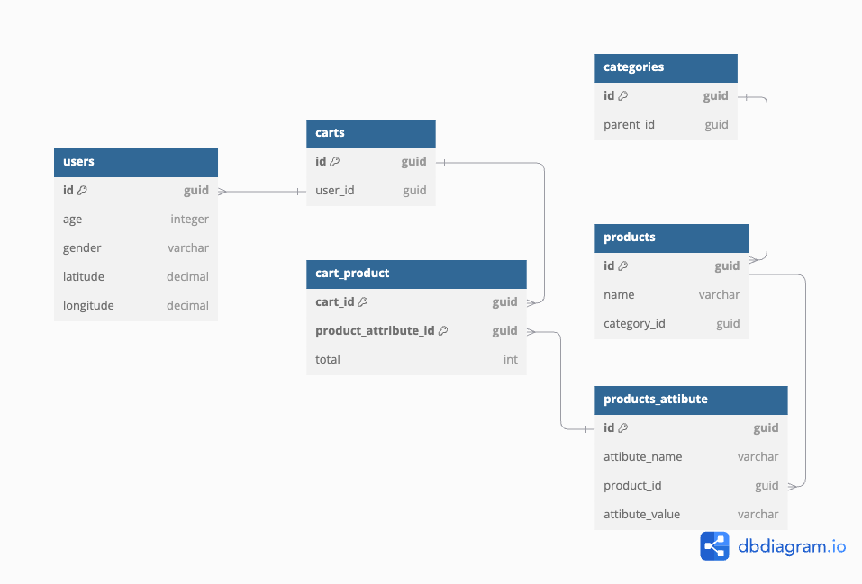

### Run

`dotnet run`

### Api Doc
`http://localhost:5047/swagger/index.html`

### Includes
 1.WebApi
 2.UnitTest With xUnit
 3. Cart Model In OPN/OPN/Carts
 4. Diagram in OPN/OPN/diagram.png

# Diagram.md

